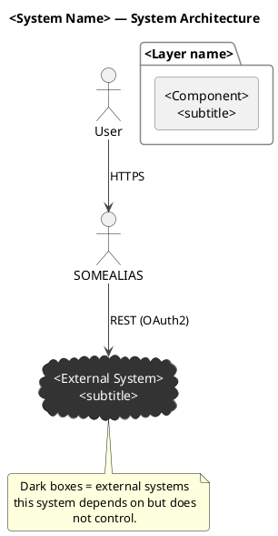

# ArchFlow

Turns a written architecture description into three things, each built from the one before it (so all three stay consistent with each other — same components, same edges, same external-system markings):

1. A **Mermaid diagram** (`system-diagram.md`) — quick, readable, renders inline in GitHub/most markdown viewers.
2. A **PlantUML diagram** (`.puml` + rendered `.png`) — translated from the Mermaid diagram.
3. An **ArchFlow demo** — an animated, playable visualization of one concrete request traveling through every component, built from the PlantUML's component/edge list, as a React component (`*.tsx` + `*.css`) and a zero-dependency `index.html` that opens directly in a browser.

This skill codifies a working, previously-debugged implementation. Two non-obvious bugs are already fixed in the templates below — do not "improve" past them without re-testing (see the FAQ at the bottom for what they were and why).

## Inputs

The user provides a path to a `system-architecture.md` or `system-diagram.md` file (or similarly named — anything describing components, layers, and how they connect, possibly already containing a Mermaid or PlantUML diagram). If no path is given, ask for one; don't guess at a file. If the user has no such file yet, tell them to first ask Claude to explore the codebase and write one (a prose architecture doc), then come back and run this skill on it.

## Output location

```
<input-dir>/
  system-architecture.md      (the input — prose, may already have a diagram)
  system-diagram.md           (Mermaid diagram — this skill creates/refreshes it)
  system-diagram.puml
  system-diagram.png
  demo/
    <Name>DemoFlow.tsx
    <Name>DemoFlow.css
    index.html
    vendor/
      react.production.min.js
      react-dom.production.min.js
      babel.min.js
```

`<Name>` is a short PascalCase identifier derived from the project/system name in the input doc (e.g. "Cpi" for an SAP CPI tool, "Order" for an order-processing system).

Naming edge case: if the input file is _already_ named `system-diagram.md`, don't create a second file with that name.

- If it already contains a Mermaid diagram, treat it as done — skip Step 2 entirely and move to Step 3.
- If it's prose only (no diagram yet), add a `## Diagram` section with the Mermaid block directly into that same file, in place, rather than creating a duplicate.

## Step 0 — Check & offer to install prerequisites

Run this once per machine (skip if you already confirmed these are present earlier in the session). **Never silently install anything** — installing packages touches the user's system (often needs sudo/admin) and is exactly the kind of action that needs a confirmation first, per usual practice. Detect, report, propose the exact command, then wait for a yes.

**Required** (the skill degrades gracefully without these, per Steps 3 and 8, but functionality is reduced):

- `plantuml` + a JRE — renders the `.png` in Step 3
- `node` + `npm` — runs the verification checks in Step 8

**Optional** (nice-to-have, skip gracefully if declined or unavailable):

- `@babel/core` + `@babel/preset-react` — fast syntax check in Step 8
- `puppeteer` — visual render check in Step 8

**Usually already present, check anyway:** `curl` (vendors the JS libs in Step 7).

### 1. Detect the platform

```bash
if [ -f /proc/version ] && grep -qi microsoft /proc/version 2>/dev/null; then
  PLATFORM="wsl"      # Windows Subsystem for Linux — behaves like Linux/apt
elif [ "$(uname -s 2>/dev/null)" = "Darwin" ]; then
  PLATFORM="macos"
elif [ "$(uname -s 2>/dev/null)" = "Linux" ]; then
  PLATFORM="linux"
else
  PLATFORM="windows"  # no uname resolvable — native PowerShell/cmd, not WSL
fi
echo "$PLATFORM"
```

### 2. Check what's already there

```bash
for cmd in plantuml java node npm curl; do
  command -v "$cmd" >/dev/null 2>&1 && echo "$cmd: found" || echo "$cmd: MISSING"
done
```

### 3. If anything required is missing, propose the matching install command and ask before running it

**macOS** (Homebrew):

```bash
brew install plantuml   # pulls in a JRE automatically
brew install node       # if missing
```

**Linux / WSL — Debian/Ubuntu (apt):**

```bash
sudo apt update && sudo apt install -y default-jre graphviz plantuml nodejs npm
```

**Linux — Fedora/RHEL (dnf):**

```bash
sudo dnf install -y java-17-openjdk plantuml nodejs npm
```

**Linux — Arch (pacman):**

```bash
sudo pacman -S --noconfirm jre-openjdk plantuml nodejs npm
```

**Windows (native, not WSL):**

- With Chocolatey: `choco install -y plantuml nodejs-lts`
- With winget (Chocolatey's `plantuml` package is more reliable than hunting for a winget equivalent): `winget install -e --id OpenJS.NodeJS.LTS` and `winget install -e --id EclipseAdoptium.Temurin.17.JRE`, then download `plantuml.jar` from https://plantuml.com/download and put a small shim on PATH (e.g. `plantuml.bat` containing `java -jar C:\tools\plantuml.jar %*`) so `plantuml -tpng ...` works the same as elsewhere.
- If neither package manager is available: install a JRE manually (adoptium.net), install Node.js manually (nodejs.org), download `plantuml.jar`, and create the same shim as above.
- If the user is actually inside WSL, use the Linux/apt instructions instead — check for that first (`$PLATFORM = wsl` above).

**Optional npm packages** (any platform, once Node/npm exist):

```bash
npm install -g @babel/core @babel/preset-react puppeteer
```

Puppeteer bundles its own Chromium (~200MB) and, on minimal Linux (containers, headless servers, WSL without a desktop), may also need extra shared libraries: `sudo apt install -y libnss3 libatk-bridge2.0-0 libgtk-3-0 libgbm1`. If any of this fails, skip it — the render check in Step 8 is explicitly best-effort and the skill works fine without it.

### 4. Proceed regardless of what the user chooses

If they decline an install, or a tool can't be installed in their environment, don't block the rest of the skill — degrade exactly as Steps 3 and 8 already describe (skip the PNG render / skip that specific verification check) and say so plainly in the final report (Step 9).

## Step 1 — Read and understand the architecture

Read the input file fully. Extract:

- **Internal components**: frontend(s), backend(s)/services, databases, sidecars, background workers, gateways/proxies.
- **External dependencies**: third-party APIs, legacy systems, SaaS tools, LLM providers — anything the system depends on but doesn't own.
- **Connections**: for each pair of components that talk to each other, note the protocol (REST/OData/gRPC/WebSocket/queue/direct-SQL) and, where relevant, the auth mechanism (JWT, OAuth2, Basic Auth, API key).

If the doc already contains a Mermaid diagram or prose description, that's your source of truth — don't invent components it doesn't mention. If it's ambiguous or thin on detail (e.g. missing how a specific integration authenticates), it's fine to note "inferred" in your own summary, but don't block on it — a reasonable, clearly-labeled assumption beats stalling.

## Step 2 — Generate the Mermaid diagram

Write (or update, per the naming edge case above) `system-diagram.md`, containing:

1. A short intro (1-2 sentences) naming what the diagram shows.
2. A prose section explaining the single most important / most easily misunderstood connection in the architecture — almost always "how does this system reach its key external dependency" (REST? a direct DB connection? a message queue? one connection or two different mechanisms for different purposes?). This is the paragraph a reader should remember.
3. A ` ```mermaid ` `flowchart TD` block:
   - Group related internal components with `subgraph "Label" ... end`.
   - One node per component: databases as `[("Name")]`, plain components as `["Name<br/>subtitle"]`.
   - External systems as `[["External System<br/>subtitle"]]` (double-bracket shape), with `classDef external fill:#333,stroke:#999,color:#fff;` applied to all of them via `class EXT1,EXT2 external;`. Keep this dark-box convention identical across the Mermaid, PlantUML, and demo outputs.
   - Label every arrow with protocol/auth, e.g. `-->|"REST, OAuth2"|`.
   - Use a dashed arrow (`-.->`) for async/polled/reverse-direction responses (e.g. "poll for result"), solid (`-->`) for request/command direction.
4. A short "Reading the diagram" bullet list explaining the arrow and dark-box conventions.

Skeleton:

```markdown
# System Architecture Diagram

This diagram shows <System Name>'s internal components, the direction data flows
between them, and how it reaches its most important external dependency: **<Name>**.

## How it connects to <Key External System>

<2-4 sentences — the one thing worth remembering about this architecture.>

## Diagram

\`\`\`mermaid
flowchart TD
User(["User / Browser"])

    subgraph Frontend
        FE["..."]
    end

    subgraph Backend
        API["..."]
    end

    DB[("...")]
    EXT[["External System<br/>subtitle"]]

    User -->|HTTPS| FE
    FE -->|"REST/JSON"| API
    API -->|SQL| DB
    API -->|"REST, OAuth2"| EXT
    EXT -.->|"polled response"| API

    classDef external fill:#333,stroke:#999,color:#fff;
    class EXT external;

\`\`\`

**Reading the diagram:**

- Solid arrows = request/command direction; dashed = async/polled response.
- Dark boxes = external systems this app depends on but doesn't control.
```

Save it to `<input-dir>/system-diagram.md`.

## Step 3 — Generate the PlantUML diagram

**Translate the Mermaid diagram from Step 2** into PlantUML — same components, same edges, same external-system markings. Don't re-derive independently from the original input doc; drifting the two diagrams apart defeats the point of generating them in sequence.

Use this style (proven to render cleanly and read well — component boxes for internal systems, `cloud` shapes for external ones, a legend note):



Write it to `<input-dir>/system-diagram.puml`.

Render it:

```bash
which plantuml
```

- If found: `cd <input-dir> && plantuml -tpng system-diagram.puml` — this produces `system-diagram.png` in the same directory (PlantUML names the output from the `@startuml <name>` identifier, which is why the diagram is named `system-diagram` above — keep that identifier as literally `system-diagram`, not the page title, or the PNG filename won't match).
- If not found: tell the user PlantUML (+ a JRE) isn't installed (`brew install plantuml` on macOS) and offer to proceed without the PNG, or wait for them to install it. Don't silently skip this step without saying so.

After rendering, view the PNG (Read tool) to sanity-check the layout before moving on — crowded/overlapping labels mean the auto-layout struggled; simplify the diagram (fewer, better-grouped packages) rather than leaving a bad render.

## Step 4 — Design the demo scenario

Using the component/edge list from Step 3's PlantUML as your working set (not a fresh read of the original input), pick **one realistic, concrete end-to-end scenario** that a user of this system would actually trigger, and that touches most or all of those components — not an abstract tour of every possible edge. Past example: for an SAP CPI test tool, the scenario was "a user runs a regression test case against CPI, coverage gets computed, AI recommends new tests and drafts docs, a legacy system gets cross-checked, and the result is saved and shown back to the user."

Break it into **4-7 phases** (e.g. kick-off → trigger → process → enrich → persist/respond) and, within each phase, one or more **steps** — a step is one interaction between two components (or one component "thinking" internally).

For each step, decide:

- **f, t**: source and destination node IDs. `f === t` means a self-working step (no network hop, node just pulses).
- **k**: `'call'` (control/hand-off), `'data'` (a response), or `'work'` (self-working) — cosmetic only, colors the log entry and pulse.
- **roundTrip**: true when it's a request-then-immediate-response pair that should animate as one back-and-forth over a single step (e.g. "ask the database for X, get X back"). When true, remember the engine's convention: `f` = the **responder** (has the data), `t` = the **asker** (initiates) — backwards-looking but required; see the template comments.
- **chat**: 1-2 short lines of dialogue per step, revealed as it plays. Keep each line under ~70 characters. This is what makes the demo readable at a glance — don't skip it.

Write 15-25 steps total. Fewer feels thin for anything beyond a trivial 3-component system; many more gets tedious to watch. If the architecture has a clearly optional/parallel side-path (e.g. a legacy integration, an audit log), it's fine to include it as its own phase — it doesn't need to block the main path.

## Step 5 — Compute the layout

Read `templates/DemoFlow.template.tsx` now (it has the exact layout rules and the full engine you'll be reusing) — its comments spell out the constraints. Summary:

- Card size is fixed: 180×76px (`NW`/`NH` in the template — don't change these, the arrow-clipping math assumes them).
- Arrange nodes in **columns** (pipeline stages, left→right) and **rows** (siblings at that stage, top→bottom).
- Column gap ≥ 100px between card edges. Row gap ≥ 140px between card edges (bubbles need ~95-100px of vertical clearance and must not collide with the next row).
- Leave ≥ 100-120px of margin above the topmost row (a bubble above a node renders at `node.y - 101`; anything higher than `y≈110` puts the bubble off-canvas).
- `STAGE_W` / `STAGE_H` = the bounding box over all nodes (`max(x + NW)`, `max(y + NH)`) plus ~20-40px margin.
- Mark external systems with `external: true` (renders as a dashed card).
- Build the `BIDIRECTIONAL` set: every pair used with `roundTrip: true` must appear here as `[a,b].sort().join('|')`, or the return arrowhead won't render.
- Decide if one step deserves the optional "persistence save" flourish (file-transfer console + flying particles) — only if there's one obvious "everything lands here" moment (e.g. a DB write). If not, set `DB_INGEST_TO` to `null` and skip the rest of those placeholders (leave them as harmless-but-unused nulls/empty values).

Work out actual (x, y) coordinates for every node by hand before writing any code — draw the grid on paper/in your head first. This is where past mistakes happened (nodes placed without enough vertical room for bubbles, causing collisions two rows down). Double-check adjacent-row math: `rowN.y + NH + 140 <= rowN+1.y` at minimum.

## Step 6 — Generate the TSX component

Copy `templates/DemoFlow.template.tsx` to `<input-dir>/demo/<Name>DemoFlow.tsx` and `templates/DemoFlow.template.css` to `<input-dir>/demo/<Name>DemoFlow.css` (the CSS file needs **no edits** — it's fully generic, uses the fixed `.archflow-container` class).

In the `.tsx` copy, replace every placeholder:

- `__COMPONENT_NAME__` (3 occurrences: CSS import, function name, default export) → e.g. `CpiDemoFlow`
- `__STAGE_W__`, `__STAGE_H__` → computed bounding box from Step 5
- `__NODES__` → the node object literal (id, x, y, icon (one emoji), title, sub, color (hex), optional `external: true`)
- `__STEPS__` → the steps array from Step 4
- `__PHASES__` → the phase labels array
- `__BIDIRECTIONAL_PAIRS__` → comma-separated quoted pairKey strings, or leave empty if no roundTrip steps
- `__DB_INGEST_*__` placeholders → fill in, or `null`/empty per the "optional" note in Step 5
- `__TITLE__`, `__SUBTITLE__` → demo title and one-line subtitle
- `__FOOTER_JSX__` → 2-4 sentences of real JSX (can use `<b>...</b>` for emphasis) explaining the most important/non-obvious connection in the architecture (the same one called out in the Mermaid diagram's Step 2 prose) — this is the one thing a viewer should remember after watching.

## Step 7 — Generate the standalone HTML

Copy `templates/index.template.html` to `<input-dir>/demo/index.html`. It needs the **same placeholder values** as the `.tsx` file (it embeds a plain-JS twin of the same component plus the CSS inlined, so it works with zero build step) — do **not** re-derive the data, reuse exactly what you wrote in Step 6.

Vendor the JS libraries so the HTML works fully offline (this is required — see FAQ for why a CDN-based version silently shows a blank page for some users):

```bash
mkdir -p <input-dir>/demo/vendor
cd <input-dir>/demo/vendor
curl -sL -o react.production.min.js "https://unpkg.com/react@18/umd/react.production.min.js"
curl -sL -o react-dom.production.min.js "https://unpkg.com/react-dom@18/umd/react-dom.production.min.js"
curl -sL -o babel.min.js "https://unpkg.com/@babel/standalone/babel.min.js"
```

If a `vendor/` folder with these three files already exists elsewhere in the project (from a previous ArchFlow run), just copy it instead of re-downloading (~2.5MB, mostly Babel).

## Step 8 — Verify before reporting done

Don't skip this — both fixed-once bugs below were caught by exactly this kind of check, not by eyeballing the code.

**Syntax check** (fast, catches JSX/data errors immediately). If `@babel/core` is resolvable (project `node_modules`, or `npm i -g @babel/core @babel/preset-react` for a quick one-off):

```bash
node -e "
const fs = require('fs');
const html = fs.readFileSync('<input-dir>/demo/index.html', 'utf8');
const code = html.match(/<script type=\"text\/plain\" id=\"app-source\">([\s\S]*?)<\/script>/)[1];
const babel = require('@babel/core');
babel.transform(code, { presets: [require.resolve('@babel/preset-react')], filename: 'demo.jsx' });
console.log('BABEL TRANSFORM OK');
"
```

**Data-integrity check** — every STEPS `f`/`t` must exist in NODES, and every `roundTrip` pair must be in BIDIRECTIONAL:

```bash
node -e "
const fs = require('fs');
const html = fs.readFileSync('<input-dir>/demo/index.html', 'utf8');
const code = html.match(/<script type=\"text\/plain\" id=\"app-source\">([\s\S]*?)<\/script>/)[1];
const start = code.indexOf('const NODES = {');
const end = code.indexOf('function buildPath');
const vm = require('vm');
const sandbox = {};
vm.createContext(sandbox);
vm.runInContext(code.slice(start, end) + '\nglobalThis.__NODES=NODES; globalThis.__STEPS=STEPS;', sandbox);
const { __NODES: NODES, __STEPS: STEPS } = sandbox;
const ids = Object.keys(NODES);
const pairKey = (a,b) => [a,b].sort().join('|');
let errors = [];
STEPS.forEach((s,i) => {
  if (!ids.includes(s.f)) errors.push('step '+i+' bad f: '+s.f);
  if (!ids.includes(s.t)) errors.push('step '+i+' bad t: '+s.t);
});
console.log(errors.length ? 'ERRORS:\n'+errors.join('\n') : 'DATA OK — '+ids.length+' nodes, '+STEPS.length+' steps');
"
```

**Render check** (best-effort — only if `puppeteer` is resolvable, e.g. this project already depends on it for something else). Skip gracefully if not available; don't install a new heavy dependency just for this check unless the user asks.

```bash
node -e "
const puppeteer = require('puppeteer');
const path = require('path');
(async () => {
  const browser = await puppeteer.launch({ headless: 'new' });
  const page = await browser.newPage();
  const errors = [];
  page.on('pageerror', e => errors.push(e.message));
  await page.setViewport({ width: 1500, height: 1000 });
  await page.goto('file://' + path.resolve('<input-dir>/demo/index.html'), { waitUntil: 'networkidle0' });
  await new Promise(r => setTimeout(r, 500));
  const nodeCount = await page.evaluate(() => document.querySelectorAll('.node').length);
  console.log('nodes rendered:', nodeCount, '| errors:', errors);
  await page.screenshot({ path: '/tmp/archflow-check.png' });
  await browser.close();
})();
"
```

Then Read `/tmp/archflow-check.png` to eyeball the layout. If `puppeteer` isn't available, tell the user the syntax/data checks passed but visual verification is manual — ask them to open `demo/index.html` and confirm.

## Step 9 — Report

Tell the user what was created (file paths), show the diagram/screenshot if you rendered one, and name the files they can open right away: `system-diagram.md` (renders inline on GitHub), `system-diagram.png`, and `demo/index.html`. Mention that `demo/index.html` needs no build step or server — just open it.

---

## FAQ / hard-won lessons (read before changing the engine)

**Q: Why generate Mermaid, then PlantUML, then the demo — in that order?**
Each stage is derived from the one before it (Mermaid → PlantUML → demo component list) rather than each being re-derived independently from the original input doc. That's what keeps all three artifacts describing the _same_ architecture — same component names, same edges, same external-system markings. Re-deriving each one from scratch invites silent drift (e.g. the demo showing a component the diagrams don't, or vice versa).

**Q: Why vendor React/ReactDOM/Babel locally instead of loading from a CDN?**
An earlier version loaded them from `unpkg.com` directly. It worked in this environment but showed a **blank page for the user** — the most likely cause is a network/browser policy blocking the CDN. Vendoring removes the dependency on internet access entirely; the file just works everywhere.

**Q: Why is the inline script `type="text/plain"` with a manual Babel transform, instead of the normal `type="text/babel"` auto-processing?**
Babel Standalone's default `"react"` preset uses the **automatic JSX runtime**, which emits `import { jsx as _jsx } from "react/jsx-runtime";` at the top of the compiled output. That's a real ES module import statement — invalid in a plain classic script — and it silently kills the entire render with `pageerror: Cannot use import statement outside a module`, with no visible error unless you check the console. The fix is forcing the **classic** runtime (`Babel.transform(source, { presets: [['react', { runtime: 'classic' }]] })`), which compiles JSX to `React.createElement(...)` calls that work fine against the global `React` from the UMD build. Do not switch this back to declarative `data-presets="react"` scanning.

**Q: Why does the CSS have special `:fullscreen` rules for `.wrap` and `svg.stage`?**
Outside fullscreen, the page can grow/scroll, so `height: auto` on the SVG (sized from its own aspect ratio) is enough — it's always fully visible. In fullscreen, `.archflow-container` gets pinned to a fixed `height: 100vh` with `overflow: hidden`. Without the fullscreen-only overrides, the SVG keeps sizing itself off its aspect ratio at the now-wider viewport, grows taller than the space actually available, and the fixed-height container silently clips the bottom row of nodes — no error, just missing content. The fix makes `.wrap` flex-grow to fill the fixed space and switches the SVG to `height: 100%` (letterboxed by `preserveAspectRatio="xMidYMid meet"`) only inside `:fullscreen`, leaving normal mode untouched.

**Q: Can I skip the verification step (Step 8) if the code looks right?**
No — both bugs above looked completely fine on read-through; they only surfaced when actually rendered in a browser (or, for the JSX-runtime bug, when a syntax/transform check was run). "It compiles" and "it renders" are different claims for this kind of file.
