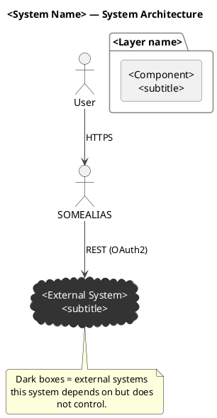
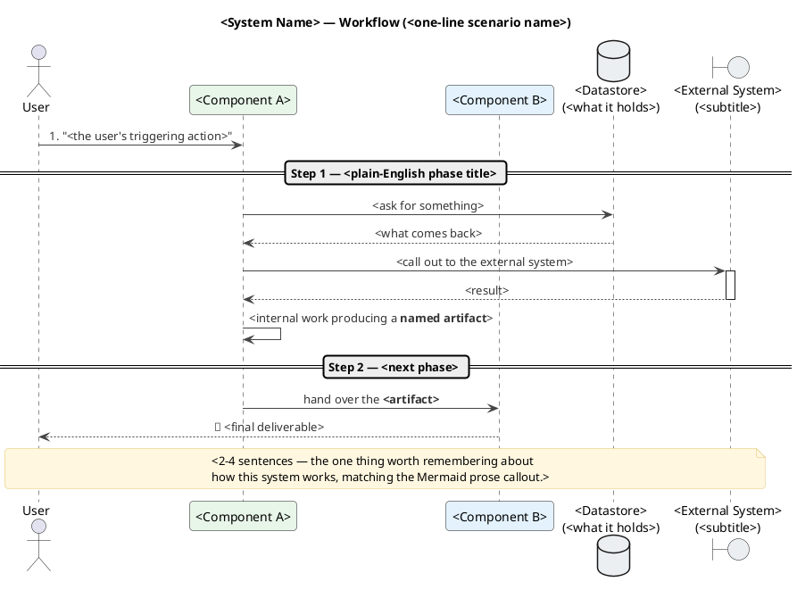

# ArchFlow

Turns a written architecture description into three things, each built from the one before it (so all three stay consistent with each other — same components, same edges, same external-system markings):

1. A **Mermaid diagram** (`system-diagram.md`) — quick, readable, renders inline in GitHub/most markdown viewers.
2. Four **PlantUML diagrams** (`.puml` + rendered `.png` each), translated from the Mermaid diagram:
   - an **architecture diagram** (`system-diagram.puml`) — the static component/connection view, complete and dense,
   - a **simplified architecture diagram** (`system-diagram-simple.puml`) — the same architecture collapsed to 8-10 boxes, for READMEs and slides,
   - a **UML workflow diagram** (`system-workflow.puml`) — a sequence diagram walking one realistic end-to-end request through those components, phase by phase, and
   - a **simplified workflow diagram** (`system-workflow-simple.puml`) — the same scenario retold with the cast collapsed to the simplified architecture's boxes, for READMEs and slides.
3. An **ArchFlow demo** — an animated, playable visualization of the same request traveling through every component, built from the workflow diagram's phases and messages, as a React component (`*.tsx` + `*.css`) and a zero-dependency `index.html` that opens directly in a browser. It opens in light mode (a 🌙/☀ header button switches theme). The engine ships with play/pause, ⏮ back / ⏭ step (one step at a time), a draggable timeline scrubber, a clickable activity log (every entry jumps to that step), a click-to-open node inspector showing each component's description, connections, and step appearances, draggable node cards (links stay attached and re-route live — lets the viewer pull cards apart when edges overlap; dragging is transient until committed with the 💾 Save layout button, which persists positions per demo via localStorage, so a reload always returns to the last saved or authored arrangement), and removable connections (click any link to open a connection inspector listing what it carries and how many later steps cutting it would strand, then ✂ Remove it — the link is drawn severed, the step over it is **blocked**, and the rest of that request is **skipped as never reached** — the run finishes with a "1 blocked, 2 never reached" summary instead of pretending the flow continued — and a ⛓ Links button reconnects everything; removals persist across reloads too).

This skill codifies a working, previously-debugged implementation. Two non-obvious bugs are already fixed in the templates below — do not "improve" past them without re-testing (see the FAQ at the bottom for what they were and why).

## Inputs

The user provides a path to a `system-architecture.md` or `system-diagram.md` file (or similarly named — anything describing components, layers, and how they connect, possibly already containing a Mermaid or PlantUML diagram). If no path is given, ask for one; don't guess at a file.

### Step 0a — No architecture doc? Generate one first

If the user has no such file (they say so, or the path they name doesn't exist and they confirm nothing like it exists), don't send them away — offer to write it in this session, then run the rest of the skill on the result:

1. Confirm scope and destination: which codebase to describe (default: the current working directory's repo) and where to save the doc (default: `system-architecture.md` at the repo root; follow the repo's convention if it keeps docs somewhere like `docs/architecture/`).
2. Read `architecture-doc-prompt.md` in this skill's folder and follow the instructions after its `---` divider exactly — explore the codebase, write the doc with every section that prompt requires, and run its closing checklist before considering the doc done. That prompt was written to produce exactly what Steps 1-5 consume; don't substitute a looser structure.
3. Before continuing, show the user a short summary — the components found, the external dependencies, the key connection, and the end-to-end scenario you chose — and ask them to confirm or correct it. This is the one checkpoint worth pausing at: every downstream artifact is derived from this doc, so a wrong component or a badly chosen scenario here multiplies into five wrong artifacts. If they correct something, update the doc first.
4. Once confirmed, treat the new file as the input and continue with Step 0 onward as normal.

If the user would rather generate the doc in a separate session (e.g. the codebase is elsewhere), hand them the same `architecture-doc-prompt.md` to paste there and run this skill on the result later.

## Output location

```
<input-dir>/
  system-architecture.md      (the input — prose, may already have a diagram)
  system-diagram.md           (Mermaid diagram — this skill creates/refreshes it)
  system-diagram.puml         (PlantUML architecture diagram — full detail)
  system-diagram.png
  system-diagram-simple.puml  (PlantUML architecture diagram — simplified, 8-10 boxes)
  system-diagram-simple.png
  system-workflow.puml        (PlantUML workflow sequence diagram — full detail)
  system-workflow.png
  system-workflow-simple.puml (PlantUML workflow sequence diagram — simplified cast)
  system-workflow-simple.png
  demo/
    <Name>DemoFlow.tsx
    <Name>DemoFlow.css
    index.html
    vendor/
      react.production.min.js
      react-dom.production.min.js
      babel.min.js
```

`<Name>` is a short PascalCase identifier derived from the project/system name in the input doc (e.g. "Cpi" for an SAP CPI tool, "Order" for an order-processing system).

Naming edge case: if the input file is _already_ named `system-diagram.md`, don't create a second file with that name.

- If it already contains a Mermaid diagram, treat it as done — skip Step 2 entirely and move to Step 3.
- If it's prose only (no diagram yet), add a `## Diagram` section with the Mermaid block directly into that same file, in place, rather than creating a duplicate.

## Step 0 — Check & offer to install prerequisites

Run this once per machine (skip if you already confirmed these are present earlier in the session). **Never silently install anything** — installing packages touches the user's system (often needs sudo/admin) and is exactly the kind of action that needs a confirmation first, per usual practice. Detect, report, propose the exact command, then wait for a yes.

**Required** (the skill degrades gracefully without these, per Steps 3 and 8, but functionality is reduced):

- `plantuml` + a JRE — renders the `.png` in Step 3
- `node` + `npm` — runs the verification checks in Step 8

**Optional** (nice-to-have, skip gracefully if declined or unavailable):

- `@babel/core` + `@babel/preset-react` — fast syntax check in Step 8
- `puppeteer` — visual render check in Step 8

**Usually already present, check anyway:** `curl` (vendors the JS libs in Step 7).

### 1. Detect the platform

```bash
if [ -f /proc/version ] && grep -qi microsoft /proc/version 2>/dev/null; then
  PLATFORM="wsl"      # Windows Subsystem for Linux — behaves like Linux/apt
elif [ "$(uname -s 2>/dev/null)" = "Darwin" ]; then
  PLATFORM="macos"
elif [ "$(uname -s 2>/dev/null)" = "Linux" ]; then
  PLATFORM="linux"
else
  PLATFORM="windows"  # no uname resolvable — native PowerShell/cmd, not WSL
fi
echo "$PLATFORM"
```

### 2. Check what's already there

```bash
for cmd in plantuml java node npm curl; do
  command -v "$cmd" >/dev/null 2>&1 && echo "$cmd: found" || echo "$cmd: MISSING"
done
```

### 3. If anything required is missing, propose the matching install command and ask before running it

**macOS** (Homebrew):

```bash
brew install plantuml   # pulls in a JRE automatically
brew install node       # if missing
```

**Linux / WSL — Debian/Ubuntu (apt):**

```bash
sudo apt update && sudo apt install -y default-jre graphviz plantuml nodejs npm
```

**Linux — Fedora/RHEL (dnf):**

```bash
sudo dnf install -y java-17-openjdk plantuml nodejs npm
```

**Linux — Arch (pacman):**

```bash
sudo pacman -S --noconfirm jre-openjdk plantuml nodejs npm
```

**Windows (native, not WSL):**

- With Chocolatey: `choco install -y plantuml nodejs-lts`
- With winget (Chocolatey's `plantuml` package is more reliable than hunting for a winget equivalent): `winget install -e --id OpenJS.NodeJS.LTS` and `winget install -e --id EclipseAdoptium.Temurin.17.JRE`, then download `plantuml.jar` from https://plantuml.com/download and put a small shim on PATH (e.g. `plantuml.bat` containing `java -jar C:\tools\plantuml.jar %*`) so `plantuml -tpng ...` works the same as elsewhere.
- If neither package manager is available: install a JRE manually (adoptium.net), install Node.js manually (nodejs.org), download `plantuml.jar`, and create the same shim as above.
- If the user is actually inside WSL, use the Linux/apt instructions instead — check for that first (`$PLATFORM = wsl` above).

**Optional npm packages** (any platform, once Node/npm exist):

```bash
npm install -g @babel/core @babel/preset-react puppeteer
```

Heads-up: globally installed npm packages are **not** on Node's default `require()` resolution path — a plain `node -e "require('@babel/core')"` won't find them. The Step 8 check commands handle this by running with `NODE_PATH="$(npm root -g)"`; keep that prefix if you adapt them.

Puppeteer bundles its own Chromium (~200MB) and, on minimal Linux (containers, headless servers, WSL without a desktop), may also need extra shared libraries: `sudo apt install -y libnss3 libatk-bridge2.0-0 libgtk-3-0 libgbm1`. If any of this fails, skip it — the render check in Step 8 is explicitly best-effort and the skill works fine without it.

### 4. Proceed regardless of what the user chooses

If they decline an install, or a tool can't be installed in their environment, don't block the rest of the skill — degrade exactly as Steps 3 and 8 already describe (skip the PNG render / skip that specific verification check) and say so plainly in the final report (Step 9).

## Step 1 — Read and understand the architecture

Read the input file fully. Extract:

- **Internal components**: frontend(s), backend(s)/services, databases, sidecars, background workers, gateways/proxies.
- **External dependencies**: third-party APIs, legacy systems, SaaS tools, LLM providers — anything the system depends on but doesn't own.
- **Connections**: for each pair of components that talk to each other, note the protocol (REST/OData/gRPC/WebSocket/queue/direct-SQL) and, where relevant, the auth mechanism (JWT, OAuth2, Basic Auth, API key).

If the doc already contains a Mermaid diagram or prose description, that's your source of truth — don't invent components it doesn't mention. If it's ambiguous or thin on detail (e.g. missing how a specific integration authenticates), it's fine to note "inferred" in your own summary, but don't block on it — a reasonable, clearly-labeled assumption beats stalling.

## Step 2 — Generate the Mermaid diagram

Write (or update, per the naming edge case above) `system-diagram.md`, containing:

1. A short intro (1-2 sentences) naming what the diagram shows.
2. A prose section explaining the single most important / most easily misunderstood connection in the architecture — almost always "how does this system reach its key external dependency" (REST? a direct DB connection? a message queue? one connection or two different mechanisms for different purposes?). This is the paragraph a reader should remember.
3. A ` ```mermaid ` flowchart block — `flowchart TD` when the architecture is layered (UI at the top, services in the middle, data and external systems at the bottom), `flowchart LR` when it reads as a pipeline of stages. Pick whichever direction lets the main path — user request in, key external dependency out — read in one straight sweep:
   - Declare nodes and subgraphs in the order the request flows through them — Mermaid lays out in declaration order, and this alone prevents most edge crossings.
   - Group related internal components with `subgraph "Label" ... end`.
   - One node per component: databases as `[("Name")]`, plain components as `["Name<br/>subtitle"]`. Keep the title to ~3 words and push detail into the `<br/>` subtitle.
   - External systems as `[["External System<br/>subtitle"]]` (double-bracket shape), with `classDef external fill:#333,stroke:#999,color:#fff;` applied to all of them via `class EXT1,EXT2 external;`. Keep this dark-box convention identical across the Mermaid, PlantUML, and demo outputs.
   - Label every arrow with protocol/auth, e.g. `-->|"REST, OAuth2"|` — and keep it that short: 1-3 tokens, never a sentence.
   - Use a dashed arrow (`-.->`) for async/polled/reverse-direction responses (e.g. "poll for result"), solid (`-->`) for request/command direction.
4. A short "Reading the diagram" bullet list explaining the arrow and dark-box conventions.

Skeleton:

```markdown
# System Architecture Diagram

This diagram shows <System Name>'s internal components, the direction data flows
between them, and how it reaches its most important external dependency: **<Name>**.

## How it connects to <Key External System>

<2-4 sentences — the one thing worth remembering about this architecture.>

## Diagram

\`\`\`mermaid
flowchart TD
User(["User / Browser"])

    subgraph Frontend
        FE["..."]
    end

    subgraph Backend
        API["..."]
    end

    DB[("...")]
    EXT[["External System<br/>subtitle"]]

    User -->|HTTPS| FE
    FE -->|"REST/JSON"| API
    API -->|SQL| DB
    API -->|"REST, OAuth2"| EXT
    EXT -.->|"polled response"| API

    classDef external fill:#333,stroke:#999,color:#fff;
    class EXT external;

\`\`\`

**Reading the diagram:**

- Solid arrows = request/command direction; dashed = async/polled response.
- Dark boxes = external systems this app depends on but doesn't control.
```

Save it to `<input-dir>/system-diagram.md`.

Before moving on, re-check the block line by line: every node referenced in an edge is declared, every `subgraph` has its `end`, and the `class ... external;` line lists exactly the external nodes. Nothing downstream re-validates the Mermaid — GitHub renders a broken block as a red error box, and no later step of this skill would catch it. If `mmdc` (mermaid-cli) happens to be installed, a render catches syntax errors for free: extract the block to `/tmp/check.mmd` and run `mmdc -i /tmp/check.mmd -o /tmp/check.png`; don't install it just for this.

## Step 3 — Generate the PlantUML diagrams (architecture + workflow, each with a simplified companion)

This step produces **four** `.puml` files, all translated from the Mermaid diagram in Step 2 — same components, same edges, same external-system markings. Don't re-derive any of them independently from the original input doc; drifting the diagrams apart defeats the point of generating them in sequence.

### 3a — Architecture diagram (`system-diagram.puml`)

The static component/connection view. Use this style (proven to render cleanly and read well — component boxes for internal systems, `cloud` shapes for external ones, a legend note):



Author the spine first: the chain user → entry point → core service(s) → key external dependency should read in a clear top-to-bottom 4-tier layout (User → Presentation & Capture → Core API & Broker → Worker, Storage, Toolchains & External AI).

**Essential Layout Rules for PlantUML Architecture Diagrams:**
1. **Never use `skinparam linetype ortho` on diagrams with edge text**: Orthogonal lines cause PlantUML to render label text directly over node borders and shape outlines. Use standard curved arrows or `skinparam linetype polyline` instead.
2. **Consolidate Local Toolchains**: Group related local CLI utilities, binary tools, and ML engines into a single consolidated node (e.g., `rectangle "Local toolchain\nFFmpeg · Whisper · Kokoro TTS · OpenCV"`) rather than creating separate boxes for each individual command or script.
3. **Include Specific Tech & Port Annotations**: Give components explicit framework and port subtitles (e.g., `Web App\nNext.js · :3000`, `API\nFastAPI · :8000`, `Redis 7\nCelery broker`).
4. **Terse Edge Labels**: Keep edge labels to 1–4 concise words describing either an action (`records / edits`, `browses target sites`) or payload (`REST/JSON + media`, `rows + files`, `send_task (name only)`).
5. **Direction Hints**: Give edges explicit direction hints (`-down->` or `-up->`) to prevent auto-layout from folding tiers on top of each other.

Write it to `<input-dir>/system-diagram.puml`.

### 3b — UML workflow diagram (`system-workflow.puml`)

A **sequence diagram** that walks **one realistic, concrete end-to-end scenario** through the components — the story of a single request, not the static wiring. This scenario is a real decision, not boilerplate: pick something a user of this system would actually trigger, and that touches most or all of the components from 3a (the same scenario later becomes the animated demo in Steps 4-7, so choose it here with that in mind). Past example: for an AI test-suite tool, the scenario was "a user says 'test this website', a Discoverer explores the site and writes a plan, a Designer reuses/writes test scripts, a Tester runs and self-heals them, and a Reporter explains the results and saves the run."

Structure and style (proven board-friendly — readable by non-engineers at a glance):

- One `participant` per internal component the scenario touches, using the **same names as 3a**, each with a soft pastel fill (rotate through `#E8F5E9`, `#E3F2FD`, `#FFF3E0`, `#F3E5F5`). Use `actor` for the user, `database` for datastores, `boundary` for external systems — those three in neutral `#ECEFF1`. Declare participants in order of **first appearance in the scenario**, left to right — messages then flow mostly rightward and long backward-reaching arrows disappear.
- Split the scenario into **3-6 numbered phases** using divider syntax: `== Step N — <plain-English title> ==`. These phase titles should read as a story ("Explore the live site, THEN write a plan"), not as component names.
- Solid arrows (`->`) for requests/hand-offs, dashed (`-->`) for responses — response labels render below their arrow (the `responseMessageBelowArrow` skinparam), so a request/response pair never has two labels fighting for the same line. Self-messages (`A -> A : ...`) for internal work, with the produced artifact in `**bold**`. Wrap `activate`/`deactivate` around a participant doing real work during a call so the activation bar shows it.
- Keep every message label short (one line, two max via `\n`); bold the nouns that matter (**Test Plan**, **Report**).
- End with the deliverable going back to the user (e.g. `A4 --> User : 📄 Report`) and a `note across` block: 2-4 sentences stating the one thing a viewer should remember — the same key connection called out in the Mermaid diagram's prose in Step 2.

Skeleton:



Write it to `<input-dir>/system-workflow.puml`.

### 3c — Simplified architecture diagram (`system-diagram-simple.puml`)

3a is the reference view: every component, every edge, accurate but dense. It is the wrong thing to put at the top of a README or on a slide. So **always** also produce a simplified companion — same architecture, fewer boxes — that someone can grasp in about ten seconds.

Derive it from 3a (not from the input doc), and target **8-10 boxes**. Collapse, in roughly this order:

- **Internals of one subsystem → one box.** An extension's content script + service worker + offscreen doc + local buffer is "Capture Extension". A worker's task registry + pipeline + renderer is "Worker".
- **Sibling leaf tools → one box.** Four local binaries/libraries become "Local toolchain — FFmpeg · Whisper · TTS".
- **A component and its own helper → the component.** A producer module folded into the service that owns it.
- **Optional externals → dropped.** Fallback providers, tracing sinks, anything that only fires when configured.

What you must **not** collapse, because it turns "simpler" into "wrong":

- Two edges to the same target **from different sources** when that's a real property (both the API and the worker calling the LLM, for different jobs). Merging them implies a single call site that doesn't exist.
- Anything whose removal implies a connection that isn't there. If A and B communicate only through a broker and a shared volume, keep all three; collapse the middle and the diagram starts asserting A calls B.
- Groupings that carry a deployment constraint (a "same host, one volume" package).

Then, so the simplified view can't be mistaken for the whole truth:

- Add a note naming what was omitted and pointing at `system-diagram.png` for the full view.
- Keep the **same** external-system convention as 3a (dark `cloud` boxes) and the same component names, so the two diagrams read as one family.

Use the same skinparams as 3a and write it to `<input-dir>/system-diagram-simple.puml`, with the identifier `@startuml system-diagram-simple`.

### 3d — Simplified workflow diagram (`system-workflow-simple.puml`)

3b is the reference telling of the scenario: every hop, every response, every intermediate artifact. Like 3a, it is the wrong thing to put in a README or on a slide. So **always** also produce a simplified companion — the same scenario retold with a smaller cast — that a stakeholder can follow in about ten seconds.

Derive it from 3b (not from the input doc, and not a new scenario), and let 3c set the cast: a participant here is one **box from the simplified architecture diagram**, same names, so the two simplified diagrams read as one pair. Target **4-6 participants and 8-12 messages**. Collapse, in roughly this order:

- **Participants that merged into one box in 3c → one participant.** Messages between components now inside the same box disappear, or — when they produced a named artifact the story needs — become a single self-message ("build the **Test Plan**").
- **A request/response pair whose response is a bare acknowledgment → one solid arrow.** Keep the dashed response only when it carries the payload the story is about.
- **Phases merge too.** 3-4 `==` dividers is plenty; keep the plain-English story titles.
- **Participants the scenario only brushes past → dropped**, along with their messages (an audit-log write, a metrics ping).

What you must **not** simplify away — same principle as 3c, a simplification must not change what the diagram claims:

- The **mechanism of the key connection** called out in the Mermaid prose in Step 2. A poll must stay a poll (dashed return), not become a push; if the system reaches its external dependency two different ways, both survive.
- The **final deliverable returning to the user** — the story must still end.
- The `note across` takeaway. Keep it, and add one line pointing to `system-workflow.png` for the full sequence, so the simplified view can't be mistaken for the whole truth.

Use the same skinparams, pastel participant fills, and `actor`/`database`/`boundary` conventions as 3b, and write it to `<input-dir>/system-workflow-simple.puml`, with the identifier `@startuml system-workflow-simple`.

### Render all four

```bash
which plantuml
```

- If found: `cd <input-dir> && plantuml -tpng system-diagram.puml system-diagram-simple.puml system-workflow.puml system-workflow-simple.puml` — this produces `system-diagram.png`, `system-diagram-simple.png`, `system-workflow.png` and `system-workflow-simple.png` in the same directory. PlantUML names each output from its `@startuml <name>` identifier, **not** the source filename — keep the identifiers as literally `system-diagram`, `system-diagram-simple`, `system-workflow` and `system-workflow-simple` (not the page titles), or the PNG filenames won't match.
- If not found: tell the user PlantUML (+ a JRE) isn't installed (`brew install plantuml` on macOS) and offer to proceed without the PNGs, or wait for them to install it. Don't silently skip this step without saying so.

After rendering, view all four PNGs (Read tool) and check each against this list before moving on — never leave a bad render:

- No overlapping or truncated labels, and no edge running through a box it doesn't connect to.
- The main path (user → system → key external dependency) reads in one sweep, without backtracking.
- External systems stand out as dark boxes at a glance.
- The workflow diagram isn't so wide it would need horizontal scrolling at README width — too many participants means drop the ones the scenario only brushes past, or shorten message labels.

If the **architecture diagram** fails, repair it with these knobs, in this order — one change at a time, re-rendering between attempts so you know what helped:

1. Avoid `skinparam linetype ortho` when edge text labels are present — orthogonal lines render label text directly over node borders and cylinder outlines. Fall back to standard curved arrows or `skinparam linetype polyline`.
2. Direction hints on the misbehaving edges (`-down->`, `-right->`) — straighten the spine before touching anything else.
3. `skinparam nodesep 50` and `skinparam ranksep 60` — breathing room when boxes crowd or labels collide.
4. `left to right direction` at the top of the file — when the system is a pipeline and top-down layout produces a tall, thin ribbon.
5. `A -[hidden]-> B` — an invisible edge to align two siblings the auto-layout scattered.
6. Last resort: regroup the packages — fewer, bigger packages give the layouter fewer constraints to fight.

If the **workflow diagram** fails, it's almost always width: re-order participants by first appearance, shorten message labels to one line, or drop a participant the scenario only brushes past.

For the two simplified diagrams, the test is different and stricter: if you can't follow the main path (architecture) or the story (workflow) at a glance, it isn't simple enough yet — collapse another subsystem, or merge another phase.

**Margins (only if asked).** PlantUML has no canvas-margin setting, so a rendered PNG sits flush against its content. If the user wants breathing room on the sides, pad it afterwards — and note that macOS `sips` silently ignores `--padToHeightWidth` here (it reports success and changes nothing), so use ffmpeg:

```bash
ffmpeg -y -i system-diagram-simple.png -vf "pad=iw+300:ih:150:0:white" out.png && mv out.png system-diagram-simple.png
```

Because this is post-processing, re-running `plantuml` silently drops it. Record the two-command sequence in a comment at the top of the `.puml` so the next person can reproduce it.

## Step 4 — Design the demo scenario

**The workflow sequence diagram from Step 3b is your script** — the full one, not the simplified 3d (the demo wants every hop) — don't invent a second scenario. Its `==` phase dividers become the demo's phases, and each sequence message (or small group of messages) becomes a step. Where the sequence diagram had to stay terse, the demo can add detail: extra intermediate steps, and per-step dialogue.

Break it into **4-7 phases** (e.g. kick-off → trigger → process → enrich → persist/respond) and, within each phase, one or more **steps** — a step is one interaction between two components (or one component "thinking" internally).

For each step, decide:

- **f, t**: source and destination node IDs. `f === t` means a self-working step (no network hop, node just pulses).
- **k**: `'call'` (control/hand-off), `'data'` (a response), or `'work'` (self-working) — cosmetic only, colors the log entry and pulse.
- **roundTrip**: true when it's a request-then-immediate-response pair that should animate as one back-and-forth over a single step (e.g. "ask the database for X, get X back" — the adjacent `->` / `-->` pairs in the workflow diagram). When true, remember the engine's convention: `f` = the **responder** (has the data), `t` = the **asker** (initiates) — backwards-looking but required; see the template comments.
- **chat**: 1-2 short lines of dialogue per step, revealed as it plays. Keep each line under ~70 characters. This is what makes the demo readable at a glance — don't skip it.

Write 15-25 steps total. Fewer feels thin for anything beyond a trivial 3-component system; many more gets tedious to watch. If the architecture has a clearly optional/parallel side-path (e.g. a legacy integration, an audit log), it's fine to include it as its own phase — it doesn't need to block the main path.

## Step 5 — Compute the layout

Read `templates/DemoFlow.template.tsx` now (it has the exact layout rules and the full engine you'll be reusing) — its comments spell out the constraints. Summary:

- Card size is fixed: 180×76px (`NW`/`NH` in the template — don't change these, the arrow-clipping math assumes them).
- Arrange nodes in **columns** (pipeline stages, left→right) and **rows** (siblings at that stage, top→bottom).
- Column gap ≥ 100px between card edges. Row gap ≥ 140px between card edges (bubbles need ~95-100px of vertical clearance and must not collide with the next row).
- Leave ≥ 100-120px of margin above the topmost row (a bubble above a node renders at `node.y - 101`; anything higher than `y≈110` puts the bubble off-canvas).
- `STAGE_W` / `STAGE_H` = the bounding box over all nodes (`max(x + NW)`, `max(y + NH)`) plus ~20-40px margin.
- Mark external systems with `external: true` (renders as a dashed card).
- Write a 1-2 sentence `desc` for **every** node — the click-to-open node inspector (side panel) shows it as the "what is this component" line. The inspector derives the node's connections and step appearances from STEPS automatically, so `desc` is the only per-node authoring this feature needs.
- Build the `BIDIRECTIONAL` set: every pair used with `roundTrip: true` must appear here as `[a,b].sort().join('|')`, or the return arrowhead won't render.
- Decide if one step deserves the optional "persistence save" flourish (file-transfer console + flying particles) — only if there's one obvious "everything lands here" moment (e.g. a DB write). If not, set `DB_INGEST_TO` to `null` and skip the rest of those placeholders (leave them as harmless-but-unused nulls/empty values).

Work out actual (x, y) coordinates for every node by hand before writing any code — draw the grid on paper/in your head first. This is where past mistakes happened (nodes placed without enough vertical room for bubbles, causing collisions two rows down). Double-check adjacent-row math: `rowN.y + NH + 140 <= rowN+1.y` at minimum.

## Step 6 — Generate the TSX component

Copy `templates/DemoFlow.template.tsx` to `<input-dir>/demo/<Name>DemoFlow.tsx` and `templates/DemoFlow.template.css` to `<input-dir>/demo/<Name>DemoFlow.css` (the CSS file needs **no edits** — it's fully generic, uses the fixed `.archflow-container` class).

In the `.tsx` copy, replace every placeholder:

- `__COMPONENT_NAME__` (3 occurrences: CSS import, function name, default export) → e.g. `CpiDemoFlow`
- `__STAGE_W__`, `__STAGE_H__` → computed bounding box from Step 5
- `__NODES__` → complete JS object literal, e.g. `{ Node1: { x: 40, y: 120, icon: "👤", title: "...", sub: "...", color: "...", desc: "..." } }`
- `__STEPS__` → complete JS array literal of step objects, e.g. `[ { f: "Node1", t: "Node2", ph: 0, k: "call", route: "...", m: "...", chat: [...] } ]`
- `__PHASES__` → complete JS array literal of phase strings, e.g. `[ "Phase 1", "Phase 2", "Phase 3" ]`
- `__BIDIRECTIONAL_PAIRS__` → comma-separated quoted pairKey strings (e.g. `"Node1|Node2"`), or leave empty if no roundTrip steps
- `__DB_INGEST_*__` placeholders → fill in, or `null`/empty per the "optional" note in Step 5
- `__TITLE__`, `__SUBTITLE__` → demo title and one-line subtitle
- `__FOOTER_JSX__` → 2-4 sentences of real JSX (can use `<b>...</b>` for emphasis) explaining the most important/non-obvious connection in the architecture (the same one called out in the Mermaid diagram's Step 2 prose) — this is the one thing a viewer should remember after watching.

## Step 7 — Generate the standalone HTML

Copy `templates/index.template.html` to `<input-dir>/demo/index.html`. It needs the **same placeholder values** as the `.tsx` file (it embeds a plain-JS twin of the same component plus the CSS inlined, so it works with zero build step) — do **not** re-derive the data, reuse exactly what you wrote in Step 6.

Vendor the JS libraries so the HTML works fully offline (this is required — see FAQ for why a CDN-based version silently shows a blank page for some users):

```bash
mkdir -p <input-dir>/demo/vendor
cd <input-dir>/demo/vendor
curl -sL -o react.production.min.js "https://unpkg.com/react@18/umd/react.production.min.js"
curl -sL -o react-dom.production.min.js "https://unpkg.com/react-dom@18/umd/react-dom.production.min.js"
curl -sL -o babel.min.js "https://unpkg.com/@babel/standalone@8/babel.min.js"
```

If a `vendor/` folder with these three files already exists elsewhere in the project (from a previous ArchFlow run), just copy it instead of re-downloading (~2.5MB, mostly Babel).

## Step 8 — Verify before reporting done

Don't skip this — both fixed-once bugs below were caught by exactly this kind of check, not by eyeballing the code.

**Syntax check** (fast, catches JSX/data errors immediately). Needs `@babel/core` + `@babel/preset-react`, either in the project's `node_modules` or installed globally (`npm i -g @babel/core @babel/preset-react`). Globally installed npm packages are **not** on Node's default `require()` resolution path, so every `node -e` check below is prefixed with `NODE_PATH="$(npm root -g)"` — harmless when the packages are local, required when they're global. Check **both** files: the HTML embeds a hand-copied twin of the `.tsx` data (Step 7), so either copy can carry a typo the other doesn't. Use `transformSync`, not `transform` — Babel 8 made `transform` callback-only, and `transformSync` works on Babel 7 too.

```bash
NODE_PATH="$(npm root -g)" node -e "
const fs = require('fs');
const babel = require('@babel/core');
const presets = [require.resolve('@babel/preset-react')];
const html = fs.readFileSync('<input-dir>/demo/index.html', 'utf8');
const embedded = html.match(/<script type=\"text\/plain\" id=\"app-source\">([\s\S]*?)<\/script>/)[1];
babel.transformSync(embedded, { presets, filename: 'demo.jsx' });
console.log('HTML EMBEDDED SOURCE OK');
const tsx = fs.readFileSync('<input-dir>/demo/<Name>DemoFlow.tsx', 'utf8');
babel.transformSync(tsx, { presets, filename: 'demo.jsx' });
console.log('TSX TRANSFORM OK');
"
```

**Data-integrity check** — validates the invariants the engine silently depends on: every STEPS `f`/`t` and every `chat` speaker exists in NODES, every `ph` indexes into PHASES, every `roundTrip` pair is in BIDIRECTIONAL (a missing entry means the return arrowhead silently never renders — the exact bug this set exists to prevent), and the DB-ingest flourish, if enabled, points at real nodes and matches exactly one non-roundTrip step. Note the slice deliberately ends at `const TITLE` so it includes the BIDIRECTIONAL and DB_INGEST declarations:

```bash
NODE_PATH="$(npm root -g)" node -e "
const fs = require('fs');
const html = fs.readFileSync('<input-dir>/demo/index.html', 'utf8');
const code = html.match(/<script type=\"text\/plain\" id=\"app-source\">([\s\S]*?)<\/script>/)[1];
const start = code.indexOf('const NODES = {');
const end = code.indexOf('const TITLE');
const vm = require('vm');
const sandbox = {};
vm.createContext(sandbox);
vm.runInContext(code.slice(start, end) + '\nglobalThis.__NODES=NODES; globalThis.__STEPS=STEPS; globalThis.__PHASES=PHASES; globalThis.__BI=BIDIRECTIONAL; globalThis.__DBF=DB_INGEST_FROM; globalThis.__DBT=DB_INGEST_TO;', sandbox);
const { __NODES: NODES, __STEPS: STEPS, __PHASES: PHASES, __BI: BI, __DBF: DBF, __DBT: DBT } = sandbox;
const ids = Object.keys(NODES);
const pairKey = (a,b) => [a,b].sort().join('|');
let errors = [];
STEPS.forEach((s,i) => {
  if (!ids.includes(s.f)) errors.push('step '+i+' bad f: '+s.f);
  if (!ids.includes(s.t)) errors.push('step '+i+' bad t: '+s.t);
  if (!(s.ph >= 0 && s.ph < PHASES.length)) errors.push('step '+i+' bad ph: '+s.ph);
  if (s.roundTrip && !BI.has(pairKey(s.f, s.t))) errors.push('step '+i+' roundTrip pair missing from BIDIRECTIONAL: '+pairKey(s.f, s.t));
  (s.chat || []).forEach((c,j) => { if (!ids.includes(c[0])) errors.push('step '+i+' chat['+j+'] bad node: '+c[0]); });
});
if (DBT) {
  if (!ids.includes(DBT)) errors.push('DB_INGEST_TO bad node: '+DBT);
  if (!ids.includes(DBF)) errors.push('DB_INGEST_FROM bad node: '+DBF);
  const m = STEPS.filter(s => !s.roundTrip && s.f === DBF && s.t === DBT).length;
  if (m !== 1) errors.push('DB_INGEST must match exactly one non-roundTrip step, found '+m);
}
console.log(errors.length ? 'ERRORS:\n'+errors.join('\n') : 'DATA OK — '+ids.length+' nodes, '+STEPS.length+' steps');
"
```

**Render check** (best-effort — only if `puppeteer` is resolvable, e.g. this project already depends on it for something else). Skip gracefully if not available; don't install a new heavy dependency just for this check unless the user asks.

```bash
NODE_PATH="$(npm root -g)" node -e "
const puppeteer = require('puppeteer');
const path = require('path');
(async () => {
  const browser = await puppeteer.launch({ headless: 'new' });
  const page = await browser.newPage();
  const errors = [];
  page.on('pageerror', e => errors.push(e.message));
  await page.setViewport({ width: 1500, height: 1000 });
  await page.goto('file://' + path.resolve('<input-dir>/demo/index.html'), { waitUntil: 'networkidle0' });
  await new Promise(r => setTimeout(r, 500));
  const nodeCount = await page.evaluate(() => document.querySelectorAll('.node').length);
  console.log('nodes rendered:', nodeCount, '| errors:', errors);
  await page.screenshot({ path: '/tmp/archflow-check.png' });
  await browser.close();
})();
"
```

Then Read `/tmp/archflow-check.png` to eyeball the layout. If `puppeteer` isn't available, tell the user the syntax/data checks passed but visual verification is manual — ask them to open `demo/index.html` and confirm.

## Step 9 — Report

Tell the user what was created (file paths), show the diagrams/screenshot if you rendered them, and name the files they can open right away: `system-diagram.md` (renders inline on GitHub), `system-diagram-simple.png` (the one to put in a README), `system-diagram.png` (full detail), `system-workflow-simple.png` (the workflow for a README/slide), `system-workflow.png` (full workflow), and `demo/index.html`. Mention that `demo/index.html` needs no build step or server — just open it. When you report the simplified diagrams, say in one line each what you collapsed into them, so the user can judge whether the abstraction is the one they wanted.

---

## FAQ / hard-won lessons (read before changing the engine)

**Q: Why generate Mermaid, then PlantUML, then the demo — in that order?**
Each stage is derived from the one before it (Mermaid → PlantUML architecture → PlantUML workflow sequence → demo phases/steps, with the simplified companions branching off their full versions: 3a → 3c and 3b → 3d) rather than each being re-derived independently from the original input doc. That's what keeps all the artifacts describing the _same_ architecture and the _same_ scenario — same component names, same edges, same external-system markings, same request story. Re-deriving each one from scratch invites silent drift (e.g. the demo showing a component the diagrams don't, or animating a different scenario than the workflow diagram tells).

**Q: Why ship both a full and a simplified version of each diagram instead of one balanced diagram?**
Because they have different jobs and a single diagram can't hold both. The full one is the reference: it has to be complete, so someone can check whether a given edge exists (or, for the workflow, exactly which messages flow and in what order). The simplified one is the explanation: it has to fit in a README header or a slide, so it has to lie by omission. Trying to split the difference produces a diagram that's too dense to skim and too lossy to trust. Generating both from the same source is what keeps them honest — same names, same edges, same external-system markings, one of them just showing fewer of them. The same logic drives the workflow pair (3b/3d), with the extra constraint that 3d borrows its cast from 3c, so the two simplified diagrams present one consistent low-resolution view of the system.

The failure mode to watch for is a "simplification" that changes what the architecture claims. Collapsing two services that only ever talk through a queue into one box doesn't remove detail, it removes a fact — and in a sequence diagram, turning a poll into a push does the same. The rule in Steps 3c and 3d is the test: drop a box or message only when nothing the remaining ones say becomes false. When in doubt, keep the box and drop a label instead.

**Q: Why vendor React/ReactDOM/Babel locally instead of loading from a CDN?**
An earlier version loaded them from `unpkg.com` directly. It worked in this environment but showed a **blank page for the user** — the most likely cause is a network/browser policy blocking the CDN. Vendoring removes the dependency on internet access entirely; the file just works everywhere.

**Q: Why is the inline script `type="text/plain"` with a manual Babel transform, instead of the normal `type="text/babel"` auto-processing?**
Babel Standalone's default `"react"` preset uses the **automatic JSX runtime**, which emits `import { jsx as _jsx } from "react/jsx-runtime";` at the top of the compiled output. That's a real ES module import statement — invalid in a plain classic script — and it silently kills the entire render with `pageerror: Cannot use import statement outside a module`, with no visible error unless you check the console. The fix is forcing the **classic** runtime (`Babel.transform(source, { presets: [['react', { runtime: 'classic' }]] })`), which compiles JSX to `React.createElement(...)` calls that work fine against the global `React` from the UMD build. Do not switch this back to declarative `data-presets="react"` scanning.

**Q: Why does the CSS have special `:fullscreen` rules for `.wrap` and `svg.stage`?**
Outside fullscreen, the page can grow/scroll, so `height: auto` on the SVG (sized from its own aspect ratio) is enough — it's always fully visible. In fullscreen, `.archflow-container` gets pinned to a fixed `height: 100vh` with `overflow: hidden`. Without the fullscreen-only overrides, the SVG keeps sizing itself off its aspect ratio at the now-wider viewport, grows taller than the space actually available, and the fixed-height container silently clips the bottom row of nodes — no error, just missing content. The fix makes `.wrap` flex-grow to fill the fixed space and switches the SVG to `height: 100%` (letterboxed by `preserveAspectRatio="xMidYMid meet"`) only inside `:fullscreen`, leaving normal mode untouched.

**Q: How do removable connections work — do I need to author anything for them?**
No. Clicking a link opens the connection inspector (what it carries, which steps use it, how many later steps cutting it would strand) and ✂ Remove drops that pairKey into a `REMOVED_LINKS` set, persisted per demo under `archflow-removed-links:<TITLE>`. That set feeds `computeStatuses()`, which labels every step `ok` / `blocked` / `unreachable` — see the next question for the semantics. Everything is derived from STEPS, so no per-node or per-step authoring is needed — but if you add a new interaction pattern to the engine, remember blocked and unreachable steps must resolve their promise (see `runStep`) or the ⏭ Step button stays disabled forever.

**Q: When a connection is removed, does the run stop?**
The **request** stops at the cut — nothing further on that chain animates. The **playhead** keeps going, walking the remaining steps and marking them as never-happened, so the log ends up being a post-mortem ("here is everything this cut cost") rather than freezing on the failure. `computeStatuses()` walks STEPS once, keeping a `reached` set:

- **`blocked`** — the step's own link was cut. It doesn't animate; the initiator flashes red with a "✕ No connection to X" bubble and the log entry goes red. The initiator is then **removed** from `reached`: it was carrying the request and couldn't hand it on, so every later step it would have started is dead too.
- **`unreachable`** — nothing reached the step's initiator, because an earlier step on that chain was blocked. Nothing is drawn at all; the log entry goes grey with "skipped — never reached".
- **`ok`** — runs normally, and both ends join `reached`.

So cutting `API → Payments` mid-chain blocks that step and skips the persist and confirmation steps after it — the earlier version left them animating, which read as the system happily saving an unpaid order. Neither blocked nor unreachable steps get done-marks, and the completion line reports the damage ("Run completed — 1 blocked, 2 never reached").

Four details matter if you touch this: (1) the initiator of a `roundTrip` step is `t`, not `f` (the engine's asker/responder convention), so `stepInitiator()` must be used everywhere rather than plain `s.f` — otherwise every round-trip goes unreachable the moment anything is cut; (2) `reached` is seeded from `ORIGINS`, the nodes whose first appearance in STEPS is as an initiator, which is what lets a legitimately self-starting step (a nightly job firing in a late phase) keep running when an unrelated link is cut; (3) a node knocked out of `reached` by a block comes back if a later step successfully delivers to it, so a retry/fallback path still plays; (4) the `starved` set — see below — is what stops an ORIGIN from silently resurrecting a dead flow. The function is pure and order-independent, so an animated run and a scrubber jump always agree.

**A poller is an ORIGIN, and that nearly broke the cascade.** `ORIGINS` catches any node whose first appearance is as an initiator — which includes the very common "service polls another service" shape, because the poller first appears as the **asker of a round-trip**. In a real generated demo (upload → Power Automate polls OneDrive → GitHub → Actions → …), cutting the _upload_ link left the poll immune to the cascade: it picked up a file that never arrived and the entire 15-step pipeline played out green. The fix is the `starved` set: a step that can't happen records its destination as starved, and a round-trip whose responder is starved is unreachable, because there is nothing there to read. Note the asymmetry that makes this correct rather than merely strict — a node that has simply never been touched yet is **not** starved (the first query to a database is normal); only one that an earlier step was _supposed_ to have fed counts. Push steps (non-roundTrip) don't check the destination at all: you don't need the receiver to hold data in order to send to it.

The one thing this model can't know is whether a step is genuinely load-bearing: STEPS has no dependency metadata, so a cut fire-and-forget hop (an audit-log write, say) also stops the chain, even though the real system would carry on. Since a demo's STEPS is by construction **one** end-to-end request, stopping is the safer default — but if a demo has a truly optional branch, say so in the step's `m` text so viewers read the stall correctly.

**Q: Why does each link have an invisible duplicate path (`.edge-hit`)?**
The visible edge is 2.2px wide — effectively unclickable. `.edge-hit` is a transparent 16px-wide twin of the same path with `pointer-events: stroke`, sitting below the node groups in DOM order so a node card still wins any click where the two overlap. Both the visible path and the hit path are rebuilt on every drag (`refreshEdgesFor`), so the hit area never drifts away from the line.

**Q: Can I skip the verification step (Step 8) if the code looks right?**
No — both bugs above looked completely fine on read-through; they only surfaced when actually rendered in a browser (or, for the JSX-runtime bug, when a syntax/transform check was run). "It compiles" and "it renders" are different claims for this kind of file.
